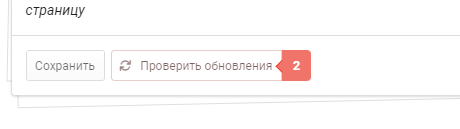
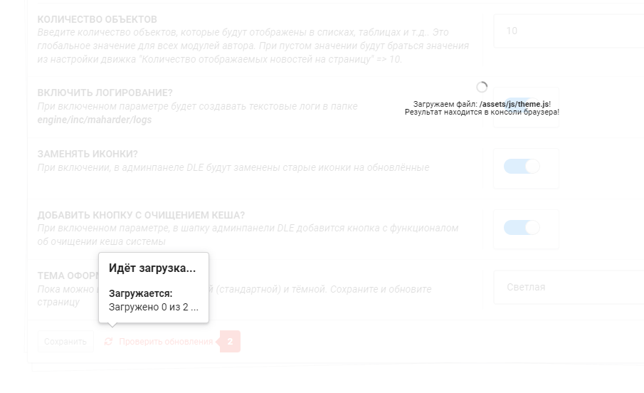

# Настройка

Административная панель работает на основе [Fomantic UI](https://fomantic-ui.com)

Глобальные настройки помогут в дальнейшем использовании плагинов

| Настройка                   | Описание                                                                                                                                                                                                                                                | Значения          |
|-----------------------------|---------------------------------------------------------------------------------------------------------------------------------------------------------------------------------------------------------------------------------------------------------|-------------------|
| Количество объектов         | Введите количество объектов, которые будут отображены в списках, таблицах и т.д.. Это глобальное значение для всех модулей автора. При пустом значении будут браться значения из настройки движка "Количество отображаемых новостей на страницу" => 10. | Только числа      |
| Логирование системы         | При включенном параметре будет создавать текстовые логи в папке**engine/inc/maharder/logs**                                                                                                                                                             | Выключатель       |
| Отправлять логи в телеграм? | При включённом параметре и заполненных полях ниже - скрипт будет отправлять логи в ваш телеграм канал                                                                                                                                                   | Выключатель       |
| API бота                    | API ключ бота, который можно получить у @BothFather                                                                                                                                                                                                     | Текст                 |
| Канал телеграма             | ID канала                                                                                                                                                                                                                                                    | Текст                 |
| Тип опивещений              | Вариация оповещений в канал: **Все** - Отправляет буквально все отчёты и логи в канал **Ошибки** - Отправляет только ошибки в канал **Информация** - Отправляет только информационные отчёты в канал **Уведомления** - Отправляет только уведомления в канал **Предупреждения** - Отправляет только предупреждения в канал **Критические ошибки** - Отправляет только критические ошибки в канал **Отладка** - Отправляет только информацию об отладке в канал  Если в плагине логирование не проставлено, то и сообщения этого рода тоже не будут отправлены. Если выбрано "Все", то остальные выбранные параметры игнорируются                                                                                                                                                                                                                                                   | Выпадающий список                 |
| Замена иконок               | При включении, в админпанеле DLE будут заменены старые иконки на обновлённые                                                                                                                                                                            | Выключатель       |
| Кнопка очистки кеша         | При включенном параметре, в шапку админпанели DLE добавится кнопка с функционалом об очищении кеша системы                                                                                                                                              | Выключатель       |
| Тема оформления             | Пока можно выбирать между светлой (стандартной) и тёмной.                                                                                                                                                                                               | Выпадающий список |

## Автообновления

Раз в день скрипт проверяет автоматически на целостность файлы. Если находятся расхождения, то индикатор уведомляет вас об этом

При нажатии на кнопку в открывшемся окне появится более подробная информация.

!!! info "К информации!"
	Информация с основного сервера обновляется раз в сутки, поэтому кнопка может не меняться некоторое время после обновления, но это нормально!

Выбираем нужный для Вас пункт и ждём обновления

