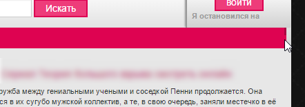

# FAQ

Ответы на часто задаваемые вопросы, которые мне задавали после приобретения

!!! warning "К прочтению!"
    Список пополнятся не будет!

## Как открыть комментарии гостям?

Заменить всё содержимое addcomments.tpl на

```html
[not-logged]
	<div class="form-group">
		<input placeholder="Ваше имя" type="text" name="name" id="name" class="form-control" required>
		<input placeholder="Ваш e-mail" type="email" name="mail" id="mail" class="form-control">
	</div>
[/not-logged]

{editor}

[recaptcha]
	{recaptcha}
[/recaptcha]

[question]
	<div class="form-group">
		<label for="question_answer">{question}</label>
		<input placeholder="Ответ" type="text" name="question_answer" id="question_answer" class="form-control" required>
	</div>
[/question]
[sec_code]
	<div class="form-group">
		{sec_code}
		<input placeholder="Повторите код" title="Введите код указанный на картинке" class="form-control" type="text" name="sec_code" id="sec_code" required>
	</div>
[/sec_code]

<div class="btn-group btn-group-justified" role="group" aria-label="editor" style="margin-bottom: 10px;">
	<div class="btn-group" role="group">
		<button type="submit" name="submit" class="btn btn-primary btn-lg btn-block">
			[not-aviable=comments]добавить[/not-aviable][aviable=comments]изменить[/aviable]
		</button>
	</div>
	<div class="btn-group" role="group">
		<button type="reset" class="btn btn-danger btn-lg btn-block">
			сбросить
		</button>
	</div>
</div>
```

## На каком фреймворке работает шаблон?

Шаблон делался на основе Bootstrap 3, так-же подключены иконки FontAwesome

## Почему стили пронумерованы?

Подключён модуль [DLE-Asset](http://pafnuty.name/modules/161-asset.html). Все файлы, что закидываются в папки CSS и JS подключаются автоматически и для этого нужно соблюдалять порядок подключения: основа, мои стили, стили движка, иконки FontAwesome и стили адаптивности. Лишь offline не подключается. JS-файлы разбросаны, так как нужные файлы подключаются до модуля. Главное, чтобы файл libs.js был в конце списка.

## Где настроить вывод левого блока?

В файле engine/modules/abc.php

## Как заменить плеер?

Если вас не устраивает плеер от kild, то замените в fullstory.tpl

```html
{include file="/engine/modules/moonserials.php"}
```

К примеру на:

```html
<iframe src="[xfvalue_video][xfgiven_season]?season=[xfvalue_season][/xfgiven_season]" width="auto" height="auto" allowfullscreen></iframe>
```

В настройках килда отключите отображение плеера и поместите `{include file="/engine/modules/moonserials.php"}` в низ файла.

## Хочу сделать отступ сверху - где менять?

Открываем файл 02.style.css шаблона и прописываем в самом низу<br />

```css
.container {margin-top: 91px;}
```

Значение выбирайте по себе.

## Как убрать отступ в строке в полной новости?



Открываем файл 02.style.css шаблона и ищем

```css
.fullinfo {...width:100%;...}
```

Меняем значение на 100.5 или 101.

## Где и в каком файле можно убрать баннер слева в новости?

Убирается в fullstory.tpl. Так-же, не забудьте убрать скрипт заглушек.
`http://static.maxim-harder.de/js/holder.js`

## Я купил FieldSearch. Как мне его подключить?

Залейте файл filter.tpl из папки Дополнительно в папку modules в шаблоне, т.е. сюда templates/seasonvar/modules. Так-же замените файл main_field.js в templates/seasonvar/field_search/js тем, что лежит в папке Дополнительно. В нём замените ДОМЕН на свой.

## Скачать инструкцию файлом

[Скачать архив](./assets/seasonvar_instructions.zip)
