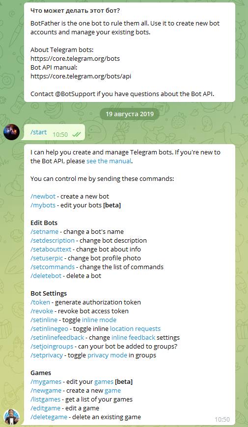
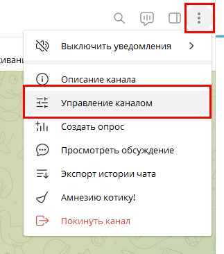
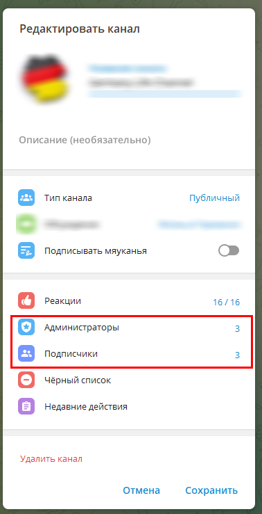
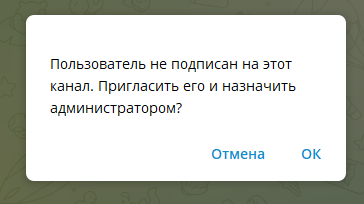
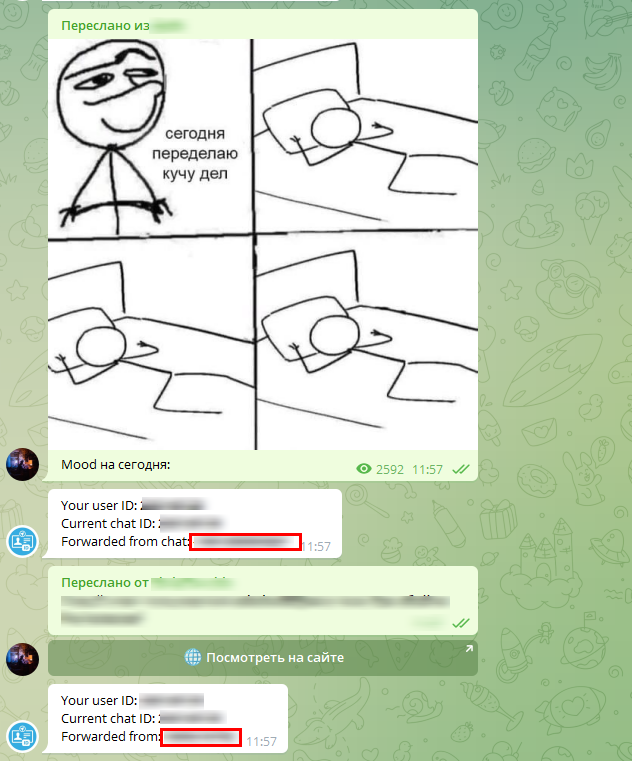

# Настройка бота

Довольно частый вопрос, на который приходится давать ответ 😂.

## Создаём бота

В вашем телеграм клиенте нужно найти [@BotFather](https://t.me/BotFather).


Запускаем бота и получаем список команд



При помощи команды <kbd>/newbot</kbd> Начинаем процесс создания нового бота

### Вопросы бота

#### Alright, a new bot. How are we going to call it? Please choose a name for your bot.

`Хорошо, новый бот. Как мы его назовём? Пожалуйста, выберите имя для вашего бота.`

Даём именнование боту. К примеру: **Мой хороший бот**

#### Good. Now let's choose a username for your bot. It must end in `bot`. Like this, for example: TetrisBot or tetris_bot.

`Хорошо. Теперь давайте выберем имя пользователя для вашего бота. Он должен заканчиваться на bot. Например, так: TetrisBot или tetris_bot.`

К примеру: **my_good_bot**

#### Завершение

*Done! Congratulations on your new bot. You will find it at t.me/my_good_bot. You can now add a description, about section and profile picture for your bot, see /help for a list of commands. By the way, when you've finished creating your cool bot, ping our Bot Support if you want a better username for it. Just make sure the bot is fully operational before you do this.*

*Use this token to access the HTTP API:*

*API-Key*

*Keep your token secure and store it safely, it can be used by anyone to control your bot.For a description of the Bot API, see this page: https://core.telegram.org/bots/api*

```
Готово! Поздравляю с новым ботом. Вы найдете его по адреси t.me/my_good_bot. Теперь вы можете добавить описание, раздел about и картинку профиля для своего бота, список команд смотрите в /help. Кстати, когда вы закончите создание своего классного бота, напишите в нашу службу поддержки ботов, если вам нужно лучшее имя пользователя для него. Перед этим убедитесь, что бот полностью готов к работе.

Используйте этот токен для доступа к HTTP API:
API-Key
Обеспечьте безопасность своего токена и храните его в надежном месте, он может быть использован кем угодно для управления вашим ботом.

Описание Bot API см. на этой странице: https://core.telegram.org/bots/api
```

На этом всё. Не давайте третьим лицам этот ключ.

## Подключение к группе / каналу

Для более комфортного использования бота - рекоммендуетця добавить его в группу / канал как администратора. Решайте сами.

Переходим в канал / группу и добавляем бота



Исходя из вашего решения - выбираем нужную группу пользователей.


В поисковой строке выбираем бота и добавляем.



## Как получить ID канала / группы?

### Публичный канал / группа

Самый простой вариант.

В окне с информацией о канале копируем ссылку


Заменяем **(https://)t.me/** на **@**. Должно получиться **@channel_name**

### Скрытый канал / группа

Есть два варианта:

#### С правами администратора

В канале, куда добавили бота, напишите любое сообщение и запустите в настройках модуля поиск канала / группы. Если всё прошло как надо -  в поле проставится ID канала / группы

#### Без администраторских прав

Данный вариант является самым простым. Достаточно открыть [@getmyid_bot](https://t.me/getmyid_bot) в клиенте и переслать в него сообщение с канала / группы



Копируем обрамлённые значения. Это и есть ID канала / группы
